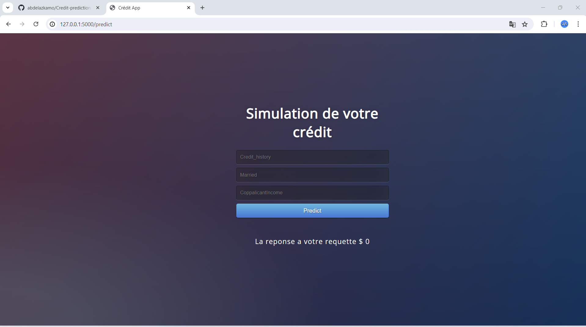

# Credit Eligibility Prediction Project

## Overview

This project focuses on predicting credit eligibility using machine learning models. It involves three main stages: data analysis and preparation, model development, and web application deployment. The final product is a user-friendly web application that predicts credit eligibility with high accuracy.

## Table of Contents

- [Overview](#overview)
- [Project Description](#project-description)
  - [Data Analysis and Preparation](#data-analysis-and-preparation)
  - [Model Development](#model-development)
  - [Web Application Deployment](#web-application-deployment)
- [Installation](#installation)
- [Usage](#usage)
- [Project Structure](#project-structure)
- [Contributing](#contributing)
- [License](#license)
- [Contact](#contact)

## Project Description

### Data Analysis and Preparation

- **Data Cleaning:** Performed extensive data cleaning to handle missing values, outliers, and inconsistencies in the dataset.
- **Preprocessing:** Applied various preprocessing techniques such as encoding categorical variables, scaling numerical features, and splitting the dataset into training and testing sets.
- **Visualization:** Created insightful visualizations to understand data distributions, correlations, and key patterns.

### Model Development

Developed and evaluated several machine learning models to predict credit eligibility:

- **Logistic Regression:** Implemented for its simplicity and interpretability.
- **K-Neighbors Classifier (KNN):** Chosen for its instance-based learning approach.
- **Decision Tree Classifier:** Used for its ability to handle non-linear relationships and feature importance insights.

After comparing the performance metrics, the most accurate model was selected for deployment.

### Web Application Deployment

- **Framework:** Used Flask to deploy the selected model, creating a web application that provides a user-friendly interface for credit eligibility predictions.
- **User Interaction:** The web application allows users to input relevant data and receive immediate predictions about their credit eligibility status.

## Installation

To run this project locally, follow these steps:

1. **Clone the repository:**

   ```sh
   git clone https://github.com/abdelazkamo/Credit-prediction.git
   cd credit-prediction/AppDeploiement
   ```

2. **Create a virtual environment:**

   ```sh
   python -m venv venv
   source venv/bin/activate  # On Windows use `venv\Scripts\activate`
   ```

3. **Install the required packages:**

   ```sh
   pip install -r requirements.txt
   ```

4. **Run the application:**
   ```sh
   flask run
   ```

## Usage

1. Open your web browser and navigate to `http://127.0.0.1:5000/predict`.
2. Enter the required input data for credit eligibility prediction.
3. Click on the 'Predict' button to get the prediction result.
